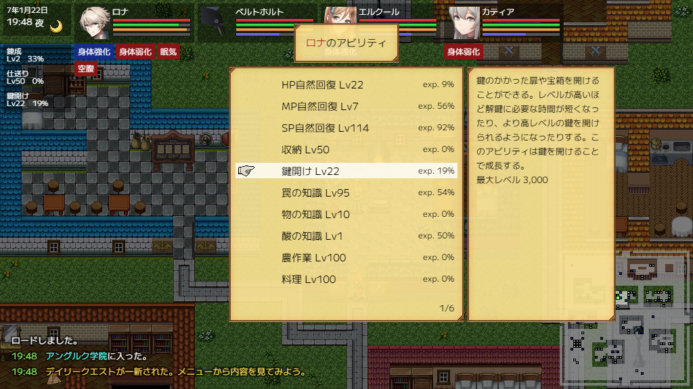

[Japanese](README.md)

# atrack - Ability Tracker Mod
## Overview
This is an unofficial mod for CoAW that can be installed using [maginai](https://github.com/Spoonail-Iroiro/maginai).  
Shows the level and the EXP of specified abilities on the window.

\* If maginai is not installed yet, install it first

## Install
Download and unzip latest `atrack-X.Y.Z.zip` from [Release](https://github.com/Spoonail-Iroiro/maginai-atrack/releases).  

`atrack` is the main folder of this mod.

## Usage

When launching with the mod installed, a window will appear around the top left corner of the main screen.

Open the ability window, and place the cursor on the ability you want to track, press one of the keys `1` through `3` to add it to the window.

# Contact

If you encounter any problems, please create an issue on this repository or contact Spoonail via [contact information listed here](https://whiteblackspace.hatenablog.com/contact-coaw)
